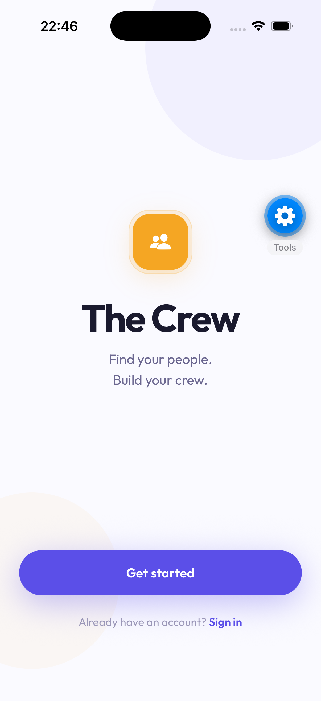
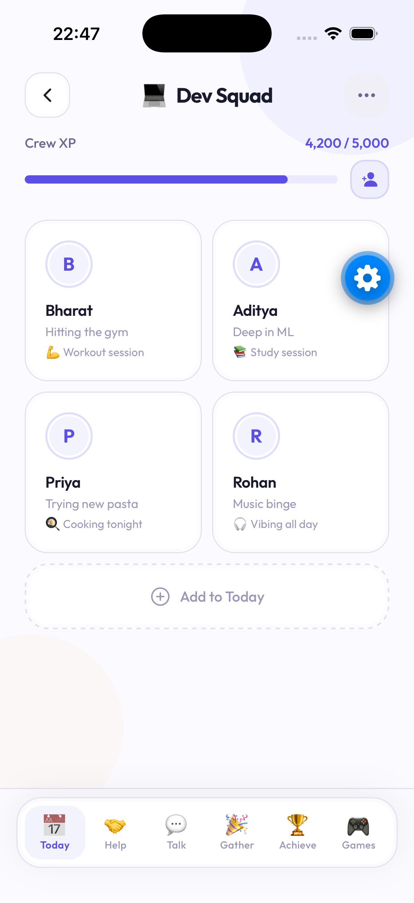
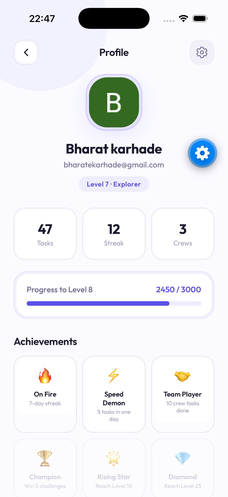
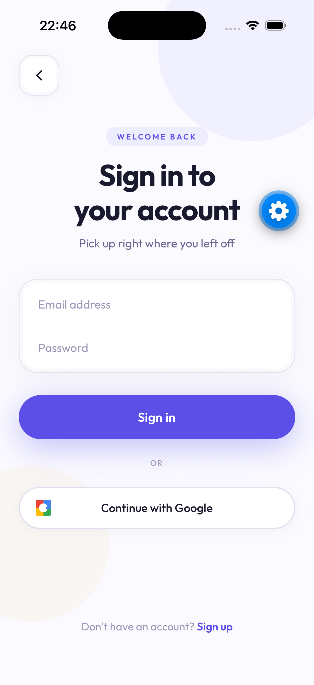
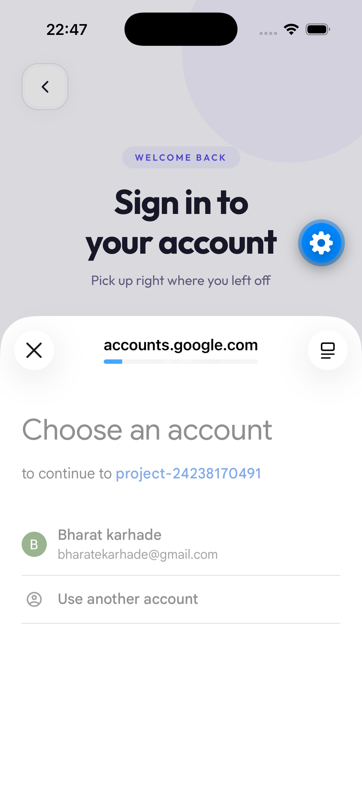

# The Crew

A Jira board for friends — but fun.

<p align="center">
  
</p>

## What is it?

The Crew is a social app for friend groups. Instead of work tickets, the "tasks" are real life moments — hitting the gym, studying for an exam, cooking tonight, or just vibing to music all day.

Everyone in your crew shares what they're up to today. Friends see it, join in, hype each other up, and the whole crew earns XP together.

**Why?** Plans die in group chats. "We should hang out" gets buried under 200 messages and never happens. Habit apps are solo. Work tools are corporate. The Crew is the middle ground — organized enough that things actually happen, fun enough that it never feels like work.

## Your crew, today

The home screen is a live status board for your friend group — see what everyone is doing right now.

<p align="center">
  
</p>

- Each member posts what they're up to — *"Hitting the gym"*, *"Deep in ML"*, *"Trying new pasta"*, *"Music binge"*
- **Crew XP** — the whole group levels up together by completing things
- **Add to Today** — post what you're doing so friends can join or hype you up
- Invite friends into the crew with one tap

## Levels, streaks & achievements

Everything you do earns XP. Level up, keep streaks alive, unlock achievements.

<p align="center">
  
</p>

- Personal level and title — *Level 7 · Explorer*
- Stats at a glance: tasks done, current streak, crews joined
- Achievements like **On Fire** (7-day streak), **Speed Demon** (5 tasks in one day), **Team Player** (10 crew tasks done)

## Getting in is easy

Sign in with email and password, or one tap with Google.

<p align="center">
  
  &nbsp;&nbsp;
  
</p>

## Architecture

```
┌─────────────────┐
│    iOS App      │   SwiftUI client
│   (frontend)    │   (web frontend TBD)
└────────┬────────┘
         │  HTTPS · REST + JWT
         ▼
┌─────────────────┐
│  Spring Boot    │   Auth (JWT + Google OAuth2)
│    Backend      │   Crews, invites, membership
│   (Render)      │   XP / achievements logic
└────────┬────────┘
         │  JDBC
         ▼
┌─────────────────┐
│   PostgreSQL    │   Users, crews, tasks,
│   (Supabase)    │   reactions, comments
└─────────────────┘
```

**How a request flows:** the app calls the REST API with a JWT → Spring Security validates the token → the service layer handles business logic (XP calculation, invite codes, achievement unlocks) → Spring Data JPA talks to Postgres on Supabase.

**Auth:** two paths into the same account system — email/password (BCrypt-hashed, JWT issued on login) and Google OAuth2. Every protected endpoint expects `Authorization: Bearer <token>`.

**Core entities:**

```
User ──< CrewMember >── Crew
                          │
User ──< TaskMember >── Task ──< Reaction
                          │
                          └────< Comment
```

- A user can belong to many crews; a crew has many members (invite-code based joining)
- Tasks belong to a crew; members join tasks, react, and comment
- Completing tasks adds XP to both the user (levels, streaks, achievements) and the crew (Crew XP)

**Deployment:**

| Component | Where |
|---|---|
| Backend (Spring Boot) | Render |
| Database (PostgreSQL) | Supabase |
| iOS app | TestFlight → App Store |
| Web frontend | TBD |

## What works right now

- ✅ Sign up / sign in with email + password
- ✅ Google sign-in
- ✅ Create a crew, invite friends, join and leave
- ✅ Crew home screen
- ✅ Profile with levels, stats and achievements

**Coming next**

- 🔜 Posting to Today
- 🔜 Reactions and hype
- 🔜 XP earned from real activity
- 🔜 Push notifications
- 🔜 Real-time board updates

## Stack

**iOS** (SwiftUI) · **Spring Boot** (Java) · **PostgreSQL** on Supabase · **Render** for deployment · JWT + Google OAuth2

---

*First users: our own friend group.*
